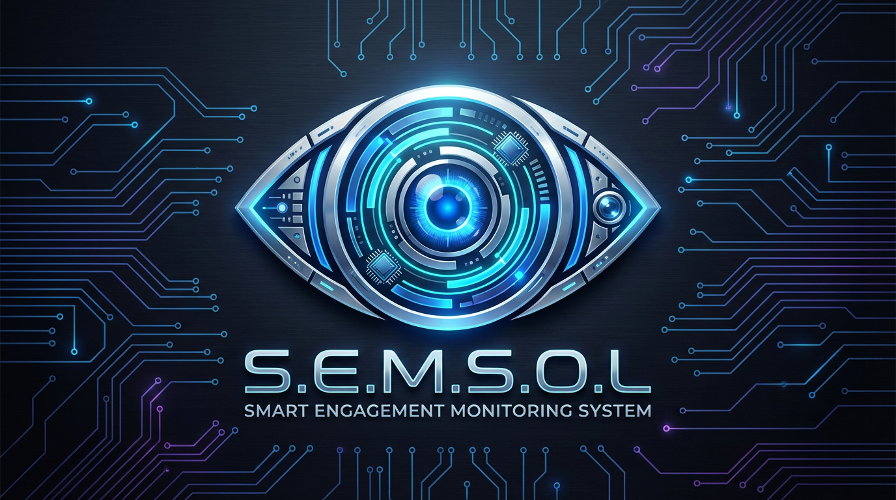

<div align="center">



#  SEMSOL - Student Engagement Monitoring System

<div align="center">


**Real-time Multi-Modal Student Engagement Detection using Computer Vision & Deep Learning**

[Demo](#-demo) • [Features](#-features) • [Installation](#-installation) • [Usage](#-usage) • [Documentation](#-documentation)

---

##  Demo

<div align="center">

### 📹 Watch SEMSOL in Action

[](https://www.youtube.com/watch?v=_XyUh5nAyrw)

**Click to watch:** Real-time engagement monitoring with live analytics and session reports

</div>

---

## 🎯 Overview

**SEMSOL** (Student Engagement Monitoring System for Online Learning) is an intelligent system that monitors and analyzes student engagement in real-time using advanced computer vision and machine learning techniques. The system combines **gaze estimation**, **blink detection**, and **deep learning classification** to provide comprehensive engagement analytics.

### 🌟 Why SEMSOL?

-  **Educational Insights**: Help educators understand student attention patterns
-  **Research Tool**: Collect quantitative engagement data for academic research
-  **Productivity Tracking**: Monitor focus and concentration during work/study
-  **Accessibility**: Analyze visual attention patterns for inclusive design
-  **Data-Driven Decisions**: Make informed improvements based on engagement metrics

---

## ✨ Features

### 🎥 Real-Time Monitoring

- ** Blink Detection**: Tracks eye blinks to detect drowsiness, stress, and distraction
- ** Gaze Estimation**: Monitors head orientation (pitch/yaw) to track attention direction
- ** ML Classification**: AI-powered engagement level prediction (4 levels)
- ** Multi-Source Support**: Works with webcam or pre-recorded video files

### 📊 Comprehensive Analytics

- **Interactive Dashboards**: Real-time metrics and visualizations
- **Engagement Timeline**: Track engagement changes throughout the session
- **Gaze Heatmaps**: Visualize where attention was focused
- **Blink Analysis**: Monitor eye activity and fatigue indicators
- **Statistical Summaries**: Detailed breakdowns of all metrics

### 💾 Export & Reporting

- **CSV Export**: Raw data for further analysis
- **JSON Reports**: Structured summaries with statistics
- **Interactive HTML Charts**: Standalone visualizations (Plotly)
- **Session Summaries**: Comprehensive engagement breakdowns

---

## 🚀 Quick Start

### Prerequisites

- Python 3.8 or higher
- Webcam (for live monitoring) or video files
- CUDA-capable GPU (optional, for faster inference)

### Installation

```bash
# Clone the repository
git clone https://github.com/Mario-Gamal-Sobhy/SEMSOL.git
cd SEMSOL
git checkout V1.2

# Install dependencies
pip install -r requirements.txt
```

### Download Model Weights

Place the following model files in the `weights/` directory:

| Model | Size | Description | Download |
|-------|------|-------------|----------|
| `resnet34.pt` | ~85 MB | Gaze estimation model | [Link](#) |
| `engagement_classifier.pkl` | ~875 KB | Engagement classifier | [Link](#) |

> **Note**: Model files are not included in the repository due to size constraints. Download them separately.

### Run the Application

```bash
streamlit run app.py
```

The app will open in your browser at `http://localhost:8501`

---

## 📖 Usage

### 1️⃣ Configure Settings

- **Video Source**: Choose webcam (0, 1, 2) or upload video file
- **Detection Options**: Enable/disable blink detection
- **ML Classifier**: Toggle trained model vs rule-based classification
- **Visual Settings**: Customize bounding boxes and gaze arrows

### 2️⃣ Start Monitoring

1. Click **"🚀 Start Monitoring"** in the sidebar
2. Wait for camera initialization (2-3 seconds)
3. Blink detector calibrates automatically (50 frames)
4. Real-time metrics appear on the right panel

### 3️⃣ View Analytics

- **For Videos**: Statistics auto-generate when video ends
- **For Webcam**: Click **"⏹ Stop Monitoring"** to view analytics
- Explore interactive charts and download reports

### 4️⃣ Export Data

Download your session data in multiple formats:
- 📄 **CSV**: Full dataset with timestamps
- 📋 **JSON**: Summary statistics and metrics
- 📊 **HTML**: Interactive charts (open in browser)

---

## 🎓 Engagement Levels

The system classifies engagement into 4 distinct levels:

| Level | Emoji | Description | Indicators |
|-------|-------|-------------|------------|
| **Highly Engaged** | 🟢 | Fully attentive and focused | Looking at screen, normal blink rate, stable gaze |
| **Engaged** | 🟡 | Generally attentive | Mostly on-task with minor distractions |
| **Partially Engaged** | 🟠 | Distracted or wandering | Irregular gaze, looking away frequently |
| **Disengaged** | 🔴 | Not paying attention | Looking away, drowsy, or distracted |

---

## 🏗️ Architecture

```
┌─────────────────────────────────────────────────────────────┐
│                        Input Stream                          │
│                    (Webcam / Video File)                     │
└──────────────────────┬──────────────────────────────────────┘
                       │
                       ▼
┌─────────────────────────────────────────────────────────────┐
│                    Face Detection                            │
│                   (RetinaFace / UniFace)                     │
└──────────────────────┬──────────────────────────────────────┘
                       │
           ┌───────────┴───────────┐
           │                       │
           ▼                       ▼
┌──────────────────────┐  ┌──────────────────────┐
│   Gaze Estimation    │  │  Blink Detection     │
│   (ResNet-34)        │  │  (EAR Algorithm)     │
│   • Pitch angle      │  │  • Blink rate        │
│   • Yaw angle        │  │  • EAR values        │
└──────────┬───────────┘  └──────────┬───────────┘
           │                         │
           └────────────┬────────────┘
                        │
                        ▼
           ┌────────────────────────┐
           │  Feature Extraction    │
           │  • Aggregated stats    │
           │  • Temporal patterns   │
           └────────────┬───────────┘
                        │
                        ▼
           ┌────────────────────────┐
           │  ML Classification     │
           │  (Random Forest / CNN) │
           └────────────┬───────────┘
                        │
                        ▼
           ┌────────────────────────┐
           │  Engagement Level      │
           │  (1-4 + Confidence)    │
           └────────────────────────┘
```

---

## 📊 Metrics Explained

### Gaze Metrics
- **Pitch**: Vertical head angle (-90° to +90°)
- **Yaw**: Horizontal head angle (-90° to +90°)
- **Looking at Screen**: |pitch| < 12° AND |yaw| < 15°

### Blink Metrics
- **EAR** (Eye Aspect Ratio): Measure of eye openness (0.0 - 1.0)
  - Typical range: 0.25 - 0.35
  - Blink detected: < 0.20
- **Blink Rate**: Blinks per second (calculated over 10s window)
  - Normal: 0.15 - 0.25 bps (9-15 bpm)
  - Drowsy: < 0.10 bps
  - Stressed: > 0.35 bps

### Engagement Score
- Overall score: 0-100 (weighted average)
- Formula: `(Highly×100 + Engaged×70 + Partial×40 + Disengaged×10) / total_frames`

---

## 🛠️ Advanced Configuration

### Camera Troubleshooting

If camera doesn't work:

1. **Test Camera**: Click "🧪 Test Camera" in sidebar
2. **Close competing apps**: Zoom, Teams, Skype, OBS
3. **Try different indices**: Switch between Webcam (0), (1), (2)
4. **Check permissions**: Allow camera access in system settings

### Model Configuration

Edit `config.py` to customize:

```python
data_config = {
    "gaze360": {
        "bins": 90,
        "binwidth": 4,
        "angle": 180
    }
}
```

### Sensitivity Tuning

- **EAR Sensitivity**: Lower = more sensitive blink detection (default: 0.80)
- **Target FPS**: Higher = faster processing, more CPU usage (default: 15)
- **Gaze Model**: Choose `resnet34` (more accurate) or `resnet18` (faster)

---

## 📁 Project Structure

```
SEMSOL/
├── app.py                          # Main Streamlit application
├── config.py                       # Configuration settings
├── uniface.py                      # Face detection module
├── requirements.txt                # Python dependencies
├── README.md                       # This file
│
├── utils/
│   ├── blink_detector.py          # Blink detection logic
│   ├── helpers.py                 # Utility functions
│   ├── ml_engagement_classifier.py # ML classifier training
│   └── save_model_example.py      # Model export utilities
│
├── weights/
│   ├── resnet34.pt                # Gaze estimation weights
│   └── engagement_classifier.pkl  # Trained classifier
│
├── assets/
│   └── in_video.mp4               # Sample test video
│
└── docs/
    └── API.md                      # API documentation
```

---

## 🔬 Research & Citations --

If you use SEMSOL in your research, please cite:

```bibtex
@software{semsol2024,
  author = {Mario Gamal Sobhy},
  title = {SEMSOL: Student Engagement Monitoring System for Online Learning},
  year = {2024},
  url = {https://github.com/Mario-Gamal-Sobhy/SEMSOL}
}
```

### Related Work

- **Gaze Estimation**: Based on Gaze360 dataset and ResNet architectures
- **Blink Detection**: Uses EAR (Eye Aspect Ratio) method from Soukupová & Čech (2016)
- **Face Detection**: RetinaFace for robust face localization

---

## 🤝 Contributing

Contributions are welcome! Please follow these guidelines:

1. **Fork** the repository
2. **Create** a feature branch (`git checkout -b feature/AmazingFeature`)
3. **Commit** your changes (`git commit -m 'Add AmazingFeature'`)
4. **Push** to the branch (`git push origin feature/AmazingFeature`)
5. **Open** a Pull Request

### Development Setup

```bash
# Clone your fork
git clone https://github.com/YOUR_USERNAME/SEMSOL.git
cd SEMSOL

# Create virtual environment
python -m venv venv
source venv/bin/activate  # On Windows: venv\Scripts\activate

# Install dev dependencies
pip install -r requirements.txt
pip install black flake8 pytest
```

---

## 🐛 Known Issues & Limitations

- **Camera Compatibility**: Some laptops require specific backends (DSHOW, V4L2)
- **Model Size**: Deep learning models require ~200MB disk space
- **GPU Required**: Real-time processing works best with CUDA GPU
- **Lighting Conditions**: Performance degrades in very low light
- **Multiple Faces**: Currently optimized for single-person monitoring

---

## 📅 Roadmap

- [ ] **Multi-person tracking**: Support multiple students simultaneously
- [ ] **Audio analysis**: Integrate speech engagement detection
- [ ] **Mobile support**: Android/iOS app versions
- [ ] **Cloud deployment**: Scalable infrastructure for classrooms
- [ ] **LMS integration**: Canvas, Moodle, Blackboard plugins
- [ ] **Privacy features**: On-device processing, no data upload
- [ ] **Real-time alerts**: Notify educators of disengagement

---

## 📜 License

This project is licensed under the MIT License - see the [LICENSE](LICENSE) file for details.

---

## 👨‍💻 Author

**Mario Gamal Sobhy**

- GitHub: [@Mario-Gamal-Sobhy](https://github.com/Mario-Gamal-Sobhy)
- Email: [your.email@example.com](mailto:your.email@example.com)

---

## 🙏 Acknowledgments

- **Gaze360 Dataset**: For gaze estimation training data
- **RetinaFace**: For robust face detection
- **Streamlit**: For the amazing web framework
- **PyTorch Community**: For deep learning tools
- **Open Source Contributors**: For libraries and inspiration

---

## 📞 Support

Having issues? Here's how to get help:

1. **Check Documentation**: Read the [Usage](#-usage) section
2. **Search Issues**: Look through [existing issues](https://github.com/Mario-Gamal-Sobhy/SEMSOL/issues)
3. **Create Issue**: Open a [new issue](https://github.com/Mario-Gamal-Sobhy/SEMSOL/issues/new) with details
4. **Discussions**: Join our [GitHub Discussions](https://github.com/Mario-Gamal-Sobhy/SEMSOL/discussions)

---

<div align="center">

**⭐ If you find SEMSOL helpful, please consider giving it a star!**

Made with ❤️ by [Mario Gamal Sobhy](https://github.com/Mario-Gamal-Sobhy)
                 [Maximos Naseef Bassiet](https://github.com/maxemosnassef-dotcom)


[⬆ Back to Top](#-semsol---student-engagement-monitoring-system)

</div>
